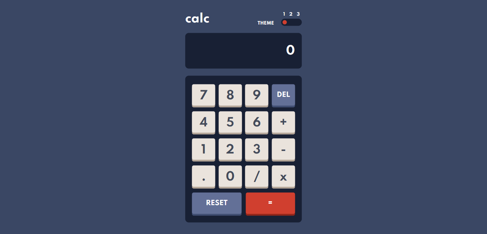

# Frontend Mentor - Calculator app solution

This is a solution to the [Calculator app challenge on Frontend Mentor](https://www.frontendmentor.io/challenges/calculator-app-9lteq5N29).

## Table of contents

- [Overview](#overview)
  - [The challenge](#the-challenge)
  - [Screenshot](#screenshot)
  - [Links](#links)
- [My process](#my-process)
  - [Built with](#built-with)
  - [What I learned](#what-i-learned)
- [Author](#author)

## Overview

### The challenge

Users should be able to:

- See the size of the elements adjust based on their device's screen size
- Perform mathmatical operations like addition, subtraction, multiplication, and division
- Adjust the color theme based on their preference

### Screenshot



### Links

- GitHub URL: [https://github.com/jesusrmz19/calculator](https://github.com/jesusrmz19/calculator)
- Live Site URL: [https://calculator.jesusrmz.com/](https://calculator.jesusrmz.com/)

## My process

### Built with

- Semantic HTML5 markup
- CSS custom properties
- Flexbox
- CSS Grid
- Mobile-first workflow
- [React](https://reactjs.org/) - JS library
- [Next.js](https://nextjs.org/) - React framework
- [Styled Components](https://styled-components.com/) - For styles

### What I learned

I was truly impressed with the complexity of the calculator logic, it took me a while getting it right, especially if you want to continue adding or multiplying numbers without hitting the equal sign.

Once I had the logic, the problem was that I was using setState to keep the accumulator value but being an async function I had to wait until it updates itself to continue my process. That's how I learned about useEffect hook:

```js
useEffect(() => {
  if (resettingRef.current) {
    resettingRef.current = false;
    displayNum();
  }
}, [acc]);
```

I had to listen to the state change in the acc state to then fire up another function because I would be out of sync between what the user is clicking and what you show on the screen otherwise.

On a completely different topic, I was able to create the theme change with simple radio buttons and passing the theme object to the Main Component, it's kind of hard to show the whole thing but I impressed myself with how I used all the things I've learned recently.

## Author

- Website - [Jesus Ramirez](https://jesusrmz.com/)
- Frontend Mentor - [@jesusrmz19](https://www.frontendmentor.io/profile/jesusrmz19)
- CodePen - [@jesusrmz](https://codepen.io/jesusrmz)
- Twitter - [@jesusrmz\_](https://twitter.com/jesusrmz_)
